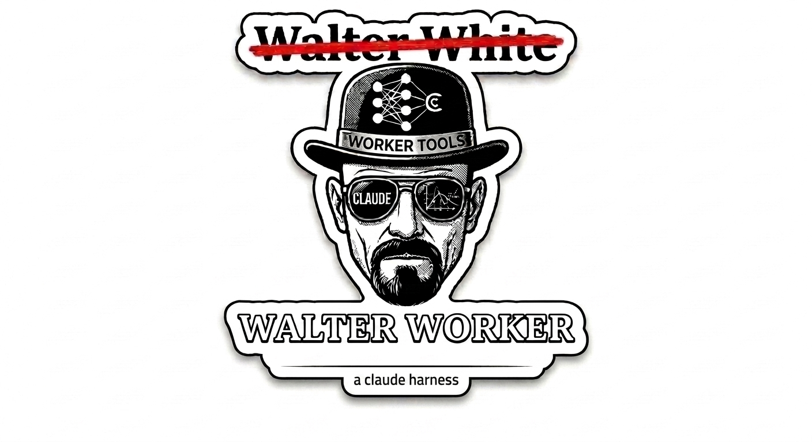

<p align="center">
  
</p>

# walter-worker

**walter-worker** gives your AI coding assistant context, skills, and memory so it stops forgetting between sessions.

---

## Install

```bash
git clone git@github.com:cicidi/walter-worker.git ~/walter-worker
cd ~/walter-worker
pipx install .
bash setup/install.sh --global
```

## Usage

walter-worker **runs inside Claude Code** — invoke skills with `/skill-name` (slash command):

**General purpose:**
```bash
/auto-tdd          # Test-driven development loop
/bug               # Debug with auto-repair
/memory            # Search past sessions & knowledge
/research          # Surface unknowns before coding
/multi-model-team  # Decompose large tasks across specialized workers
```

**Project & docs:**
```bash
/initiative        # Cross-project work tracking
/project           # Manage project catalog
/status            # Show config & initiative progress
/doc-organize      # Document placement & INDEX.md
/doc-review        # Adversarial spec/design review
/knowledge         # Extract insights from sessions
/dashboard         # Analytics — session stats & trends
```

**Spec-driven development:**
```bash
/wayfinder         # Chart decision briefs for work too big for one session
/to-spec           # Turn brainstorming output into a structured spec
/to-tickets        # Break spec into trackable GitHub issues
/implement         # Execute tickets one at a time against the spec
/prototype         # Quick throwaway prototype to validate ideas
/domain-modeling   # Map domain concepts before writing code
/grill-with-docs   # Review design against official documentation
```

Run `coworker sync` to pull latest skills from [the-super-lab](https://github.com/cicidi/the-super-lab) into your IDE — it auto-detects Claude Code, OpenCode, and Gemini CLI.

```bash
coworker sync          # Sync skills & config to all IDEs
coworker status        # Show what's configured
```

## Skill Management

Skills are created, edited, and versioned in **[the-super-lab](https://github.com/cicidi/the-super-lab)** — a curated collection of framework-agnostic SKILL.md files. Fork it, copy skills between projects, or contribute your own. walter-worker handles distribution: it syncs them from the-super-lab into your IDE's config.

## Analytics Dashboard

Every Claude session gets recorded. Browse usage patterns, skill effectiveness, and cost trends:

```bash
coworker analytics create-db     # Initialize tracking database
coworker analytics import        # Import session data
coworker analytics dashboard     # Launch at http://localhost:8080
```

Tabs: Sessions • Projects • Models • Cost/Token • Efficiency • Evolution • Data Quality

## Testing

```bash
python -m pytest tests/ -v
```

## How It Works

walter-worker writes into managed comment blocks inside your `CLAUDE.md` — your own content is never touched:

```markdown
# Your CLAUDE.md — your content lives here, untouched

<!-- COWORKER:STATIC START -->
## Project Catalog
| Project | Path | Upstream | Downstream |
|---------|------|----------|------------|
| walter-worker | ~/walter-worker | — | the-super-lab |
<!-- COWORKER:STATIC END -->

<!-- INITIATIVE:self-evolving-agent START -->
## Active Initiative: self-evolving-agent
<!-- INITIATIVE:self-evolving-agent END -->
```

## Built On

walter-worker stands on the shoulders of these projects:

| Project | What we use |
|---------|-------------|
| **[the-super-lab](https://github.com/cicidi/the-super-lab)** | All skills live here — curated, versioned, framework-agnostic |
| **[skill-factory](https://github.com/cicidi/skill-factory)** | Skill lifecycle: create, edit, import, publish |
| **[mem0](https://github.com/mem0ai/mem0)** | Vector memory layer — cross-session recall |
| **[Guild AI](https://github.com/mathomhaus/guild)** | Multi-agent orchestration patterns |
| **[Jam](https://github.com/Dag7/jam)** | Browser-based MCP agent reference |
| **[Pioneer](https://agent.pioneer.ai)** | Self-evolving agent research foundation |

## License

MIT
